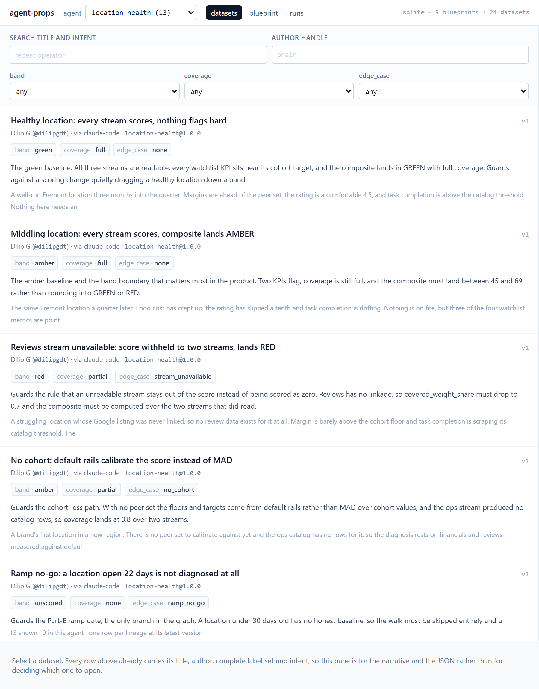
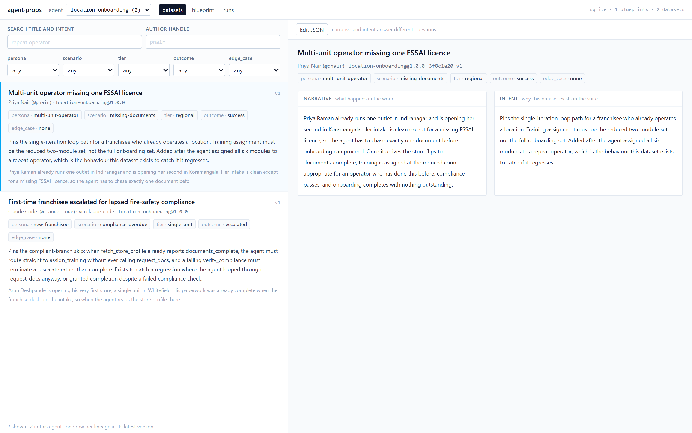
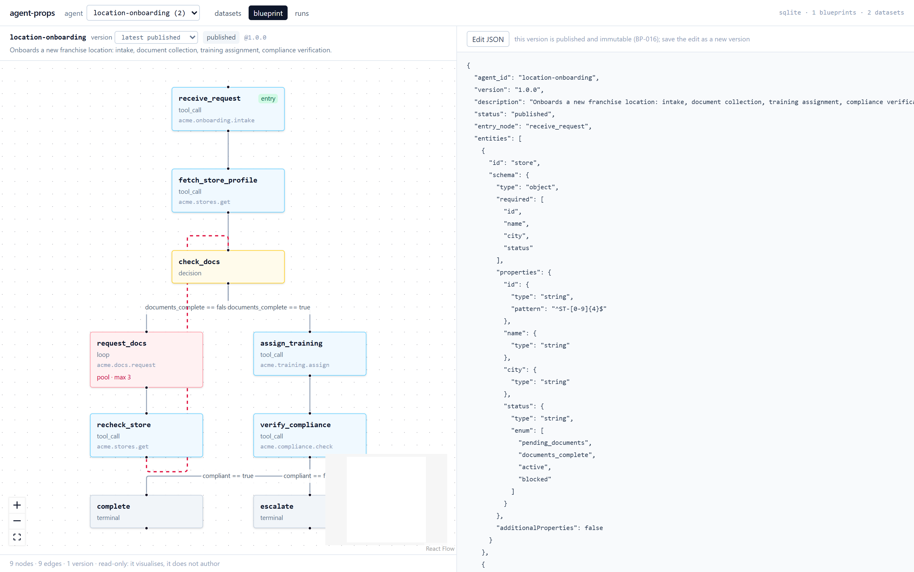
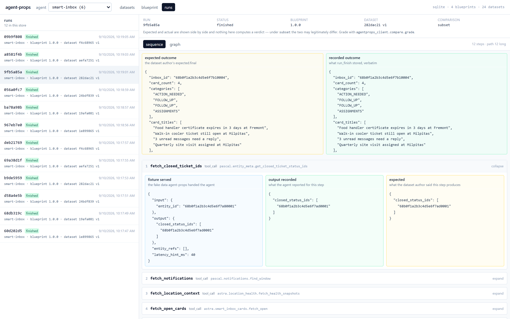
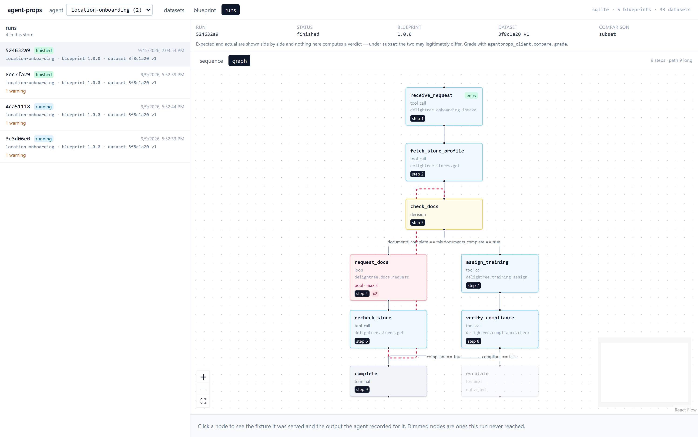

# agent-props

**Test agents against hand-authored worlds instead of hand-written mocks.**

An agent that calls eight tools needs eight mocks, and a second scenario needs eight more. The
mocks drift from the real tools, they encode no story, and nobody reading them can tell whether the
suite covers the case that matters. Most agent test suites die here — not from being wrong, but
from being too tedious to extend.

agent-props inverts it. You describe the agent's steps **once** as a *blueprint* — a graph of nodes,
each naming the tool it really calls. Then you write *datasets*: one coherent world per scenario,
with a fixture for every node, a narrative in plain English, and the outcome you expect. At test
time the agent calls `fetch_step` over MCP wherever it used to call the real tool, and the world
answers.

Adding the ninth scenario costs one dataset, not eight mocks.

---

## Who it helps

| | |
|---|---|
| **Engineers building agents** | One seam in your code — an injected client — replaces every mock. Runs are deterministic and pinned to a dataset version, so a failure reproduces exactly. |
| **Whoever writes the scenarios** | A dataset is JSON and prose, not test code. The person who understands the edge case can author it without touching the agent's repo. |
| **Reviewers** | Every dataset carries a title, intent, author and labels, so you can judge whether a suite covers the real risks without reading a line of code. |
| **Anyone running evals** | `run_evidence` hands you expected and actual side by side; `run_export` publishes the run to Langfuse or any OTLP collector as a trace. |

## What it looks like

A suite of scenarios you can judge without opening one — each row carries its intent, its labels
and who wrote it:



Narrative and intent are separate fields and answer different questions — *what happens in the
world* versus *why this dataset is in the suite*:



The blueprint is the agent's own topology, validated by nineteen rules that catch an unreachable
node, a cycle with no loop node, or a condition on a field no schema declares. Published versions
are immutable:



After a run, every step shows three things kept deliberately apart — the fixture served, the output
the agent recorded, and what the dataset author expected:



Or read the same run folded onto the graph: step numbers, how many times a loop ran, and dimmed
nodes for the branch this run never took:



## What it deliberately does not do

These are the design, not gaps:

- **It never grades.** `record_step` and `run_finish` store what you send, verbatim, checked against
  nothing. Comparison is three pure functions in the Python client, run in *your* test — because a
  fixture service that also decides pass/fail is a fixture service you cannot disagree with.
- **It never gates.** No tool refuses to serve. Policy problems arrive as warnings on a successful
  response, so a nightly suite never fails because a label was missing.
- **No model runs inside it.** No API key handling, no judge, nothing to bill.
- **Nothing is deleted.** Datasets are immutable and versioned; edits copy-on-write, and archiving
  hides a lineage without destroying it.

## Start here

```bash
uv sync
uv run python scripts/seed_demo.py demo.db
uv run python -m agentprops.server --transport http --store demo.db
cd web && npm install && npm run dev        # dashboard at http://localhost:5173
```

Point your harness at the MCP endpoint and read `agentprops://orientation` — it carries the order
of operations, which phase your store is at, and the practices worth knowing before you author
anything.

| Document | For |
|---|---|
| [docs/connect-your-agent-repo.md](docs/connect-your-agent-repo.md) | Wiring agent-props into your own agent's repository |
| [docs/usage.md](docs/usage.md) | The full reference: every tool, the rule catalogue, storage, containers |
| [docs/prd.md](docs/prd.md) | Why each decision was made |
| [docs/contracts.md](docs/contracts.md) | Schemas, error envelope, tool signatures |
| [CLAUDE.md](CLAUDE.md) | Invariants and layering rules, if you are changing the code |

Python 3.12+, MCP over stdio or streamable HTTP, SQLite / PostgreSQL / MongoDB behind one storage
protocol.

## Licence

[MIT](LICENSE). Use it, fork it, ship it.
